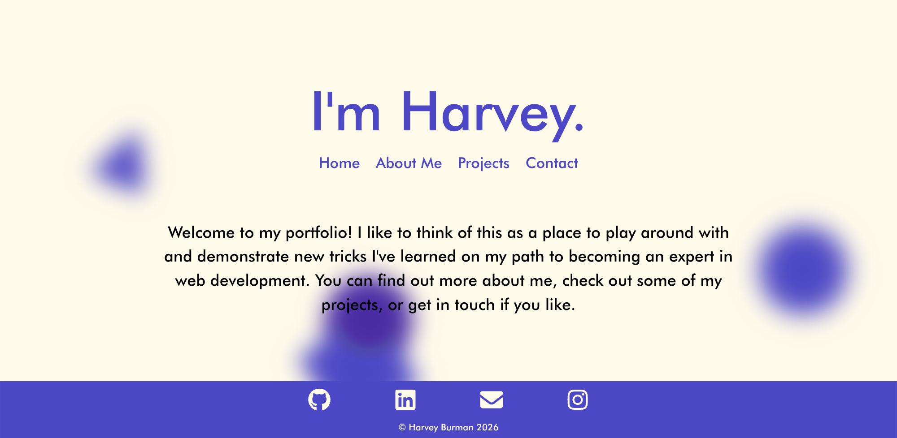

# Portfolio

This portfolio site is a showcase of all my main projects. It also serves as a demonstration of my knowledge of user-friendly design & experience, creating responsive user interfaces, and CSS skills. 

Live Demo: https://portfolio-nine-kappa-34.vercel.app/
Frontend Repo: https://github.com/hravv/Portfolio

---

## Table of Contents

- [Overview](#overview)
- [Features](#features)
- [Tech Stack](#tech-stack)
- [Screenshots](#screenshots)
- [Deployment](#deployment)
- [Future Improvements](#future-improvements)
- [Credits](#credits)
- [License](#license)

---

## Overview

### Objective

I built this portfolio to show other developers and potential employers what my work looks like and give them ways to contact me. Every new project marks a step taken in my journey towards full-stack development and a career in web development.

### Learning Outcomes

- Designed responsive, dynamic user interface
- Used CSS to create moving shapes background
- Implemented contact form
- State-based content delivery + navigation instead of separate pages
- Used motion.dev for smooth transitions

---

## Features

- Fully responsive design
- Quick, state-based navigation
- Full CSS styling, including moving background
---

## Tech Stack

### Frontend
- React 
- HTML5
- CSS3 / Tailwind (+ Motion)
- JavaScript

### Tools
- Git & GitHub
- VS Code

---

---

## Screenshots

---

## Deployment

- Frontend deployed on Vercel

## Future Improvements

- Add dark mode
- Add update feed
- Add scroll progress bar

---

## Credits

Developer: Harvey Burman
GitHub: https://github.com/hravv  

---

## License

This project is licensed under the MIT License.
